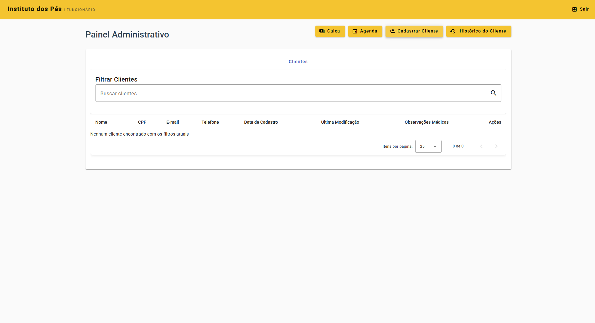
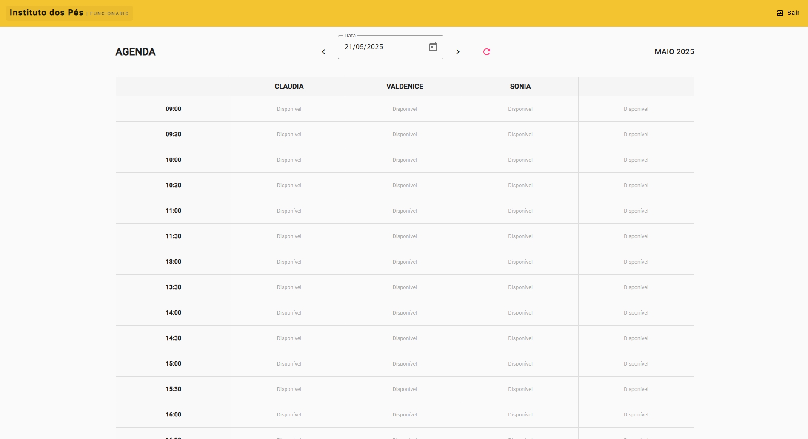
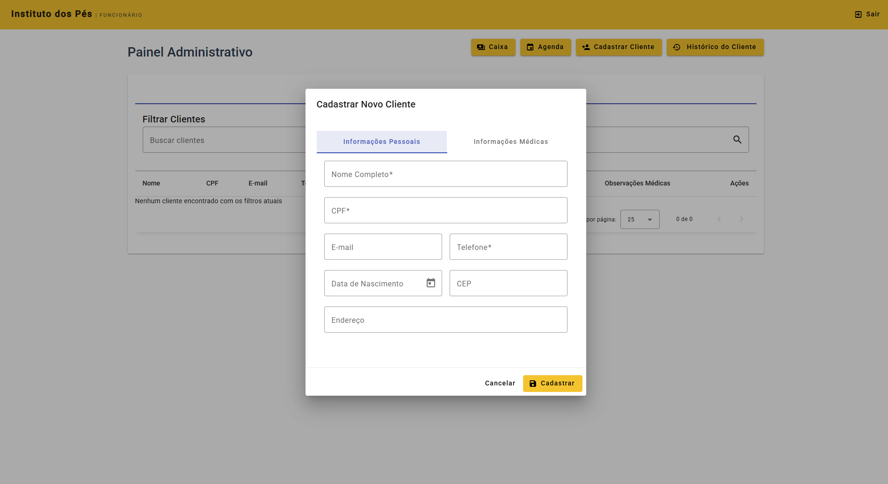

# Instituto dos Pés - Sistema de Gerenciamento

Sistema de gerenciamento completo para clínica de podologia, permitindo controle de agendamentos, clientes, pagamentos e relatórios.

## Sobre o Sistema

O Sistema de Gerenciamento do Instituto dos Pés foi desenvolvido para otimizar todos os processos da clínica, garantindo maior produtividade e melhor experiência para clientes e profissionais.

### Funcionalidades Principais

- **Agenda inteligente** com controle de disponibilidade
- **Cadastro de clientes** com histórico médico
- **Gestão financeira** completa com relatórios
- **Dashboard administrativo** com métricas e indicadores
- **Controle de acesso** com diferentes perfis de usuário
- **Interface responsiva** para uso em diversos dispositivos

## Tecnologias Utilizadas

- **Frontend**: Angular Material, TypeScript
- **Backend**: Firebase (Firestore, Authentication)
- **Hospedagem**: Cloudflare Pages
- **Integração contínua**: GitHub Actions

## Capturas de Tela

### Dashboard Administrativo

### Agenda

### Cadastro de Clientes

## Contato e Redes Sociais

- **Website**: [Instituto dos Pés](https://www.institutodospes.com.br/index.html)
- **Instagram**: [@institutodospes](https://www.instagram.com/institutodospes/)
- **Telefone**: (61) 3561-2289

## Direitos de Uso

O sistema foi desenvolvido exclusivamente para o Instituto dos Pés. Todos os direitos reservados.

&copy; 2025 Instituto dos Pés. Todos os direitos reservados.
